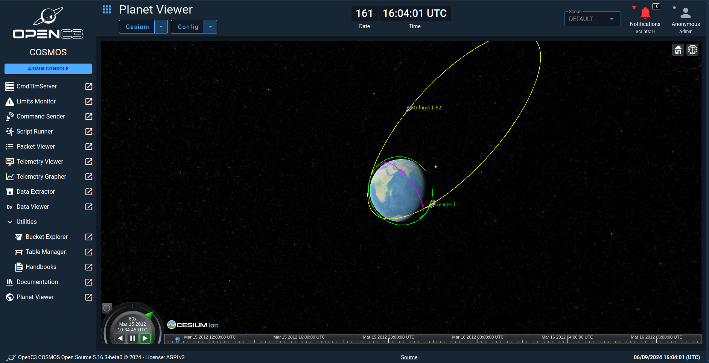

# cosmosc2-tool-planetviewer

This plugin provides the Cosmos v5 with an integrated Cesium viewer. The user can visualize data on the globe in realtime or rewatch a time with data pulled from Cosmos. The user can also load czml files and add static points or dynamic points.




## Building

```sh
yarn
#
yarn build
#
rake build VERSION=5.X.X
```
